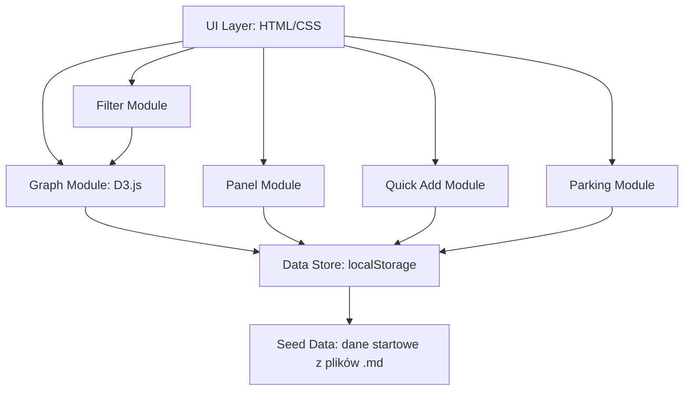

# Design — Cortex

## Przegląd architektury

**Stack:** Vite + vanilla HTML/CSS/JS + D3.js (graf) + localStorage (persystencja)

Zero frameworków UI. Jeden `index.html`, jeden `style.css`, jeden `main.js` + moduły.
D3.js z CDN (force-directed graph). Dane w localStorage jako JSON.

## Diagram



---

## Kluczowe decyzje

### 1. Vanilla JS zamiast React/Vue
Problem: użytkownik chce żeby Flash zakodował szybko, bez boilerplate'u.
Rozwiązanie: vanilla JS + moduły ES6.
Uzasadnienie: prostota, zero buildu (Vite serwuje as-is), łatwe do debugowania.

### 2. D3.js force-directed graph
Problem: potrzebna wizualizacja grafu z fizyką (drag, zoom, collision).
Rozwiązanie: D3.js v7 — standard do grafów w przeglądarce.
Uzasadnienie: dojrzała biblioteka, dobra dokumentacja, force simulation out of the box.

### 3. localStorage zamiast pliku/bazy
Problem: dane muszą przetrwać reload bez backendu.
Rozwiązanie: localStorage z auto-save po każdej zmianie.
Uzasadnienie: zero setup, zero serwera, limit 5-10MB wystarczy na setki node'ów tekstowych.

### 4. Design: profesjonalny-neutralny, nie futurystyczny
Problem: typowy dark-mode sci-fi wygląd jest oklepany.
Rozwiązanie: paleta inspirowana Linear/Notion/Vercel — ciepłe neutralne, jeden accent color.
Uzasadnienie: użytkownik wprost powiedział "mniej futurystycznie, bardziej profesjonalny design".

---

## Design System

### Paleta kolorów

```
Background:     #111113 (prawie czarny, ciepły)
Surface:        #1a1a1f (karty, panele)
Surface hover:  #222228
Border:         #2a2a32 (subtelne)
Border focus:   #4f46e5 (indigo — jedyny akcent)

Text primary:   #ededef
Text secondary: #8b8b94
Text muted:     #55555e

Typy node'ów:
  aksjomat:   #e5a54b (warm amber, nie neon)
  pewnik:     #c4a43a (stonowane złoto)
  przeblysk:  #4da8a0 (stonowany teal)
  rozrzutka:  #7c6cb5 (stonowany fiolet)
  problem:    #c45c5c (stonowana czerwień)

Akcent (UI):    #4f46e5 (indigo — buttony, focus states, selected)
Akcent hover:   #5b52f0
```

### Typografia

```
Font: Inter (Google Fonts)
  H1: 20px / 600
  H2: 14px / 600
  Body: 13px / 400
  Caption: 11px / 500
  Monospace: 12px / JetBrains Mono (tylko daty, ID)
```

### Node styling na grafie

```
Aksjomat:   r=20, fill 12% opacity, stroke 2px, label bold
Pewnik:     r=16, fill 10% opacity, stroke 1.5px
Przebłysk:  r=14, fill 10% opacity, stroke 1.5px
Problem:    r=13, fill 8% opacity, stroke 1.5px dashed
Rozrzutka:  r=10, fill 8% opacity, stroke 1px

Połączenia: stroke #2a2a32, 1px, opacity 0.5
Połączenia active: stroke accent, 1.5px, opacity 1
```

### Animacje

```
Panel slide: 250ms ease-out
Node appear: 300ms fade + scale from 0.5
Node hover: 150ms brightness(1.15) + subtle shadow
Filter dim: 200ms opacity 0.15
Button hover: 120ms scale(1.02)
```

### Layout

```
┌─────────────────────────────────────────────┐
│ [⬡ CORTEX]  [Search...]  [Filtry]  [≡]     │  ← Top bar, 52px
├─────────────────────────────────────────────┤
│                                    ┌───────┐│
│                                    │ Panel ││
│           GRAF                     │ 360px ││
│        (D3 canvas)                 │       ││
│                                    │       ││
│                                    └───────┘│
│           ┌────────────────────────┐        │
│           │ [rozrzutka] [!] [aks]  │        │
│           │ [...input...]          │        │
│           └────────────────────────┘        │
└─────────────────────────────────────────────┘
```

Quick add NA DOLE (nie na górze) — bliżej kursora, naturalniejsze.
Panel po prawej — slide-in 360px.
Filtry w top bar — toggle buttons.

---

## Struktura plików

```
cortex-app/
├── index.html           ← entry point
├── style.css            ← cały design system + layout
├── src/
│   ├── main.js          ← init, event wiring
│   ├── graph.js         ← D3 force graph (render, zoom, drag, physics)
│   ├── store.js         ← localStorage CRUD (nodes, links, parking)
│   ├── panel.js         ← panel boczny (show, hide, edit, delete)
│   ├── quickadd.js      ← input + type picker + add logic
│   ├── filter.js        ← filtrowanie po typie + search
│   ├── parking.js       ← parking view (list, restore)
│   ├── seed.js          ← dane startowe (twoje aksjomaty, rozrzutki z plików)
│   └── constants.js     ← kolory, rozmiary, config
├── requirements.md
├── design.md
├── tasks.md
└── package.json         ← vite dev dependency only
```

---

## Zależności i integracje

| Biblioteka | Rola | Źródło |
|---|---|---|
| D3.js v7 | Force-directed graph, zoom, drag | CDN lub npm |
| Vite | Dev server + HMR | npm (devDependency) |
| Inter font | Typografia | Google Fonts CDN |
