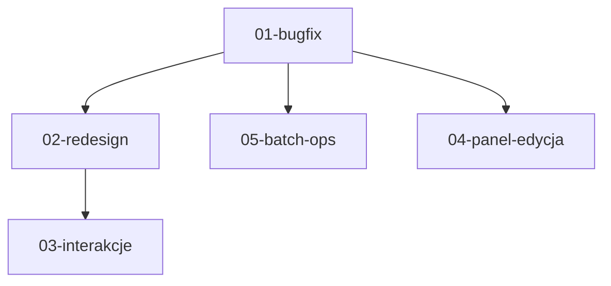

# Cortex — Spec Index

## Kolejność wdrożenia

Wyrobnik dostaje JEDEN folder na raz. Każdy folder = requirements + design + tasks.

```
01-bugfix      → PIERWSZY. Bez tego nic nie działa.
02-redesign    → DRUGI. Professional look.
03-interakcje  → TRZECI. Neighborhood highlight, Tab linking, klik na tło.
04-panel-edycja → CZWARTY. Zmiana typu, inline edit, usuwanie połączeń.
05-batch-ops   → PIĄTY. Multi-select + mass delete (wymaga 01-bugfix).
```

## Zależności



## Jak karmić wyrobnika

1. Otwórz Windsurf/Trae
2. Wklej CAŁY folder danego specka (requirements + design + tasks)
3. Powiedz: "Przeczytaj spec. Zrób zadania z tasks.md po kolei. Checkpoint po każdym bloku."
4. Wyrobnik robi blok → testuje → raportuje
5. Ty sprawdzasz → idziesz dalej

## Co jest już zrobione (stan na 08.05.2026)

Pliki istnieją: `main.js`, `graph.js`, `store.js`, `panel.js`, `quickadd.js`, `filter.js`, `parking.js`, `seed.js`, `constants.js`, `style.css`, `index.html`.

Apka się odpala ale:
- JS crash na batch-actions (brak HTML)
- Prawy klik crashuje (brak import store)
- Invalid Date w panelu (brak createdAt w seed)
- Design za neonowy/futurystyczny
- Brak neighborhood highlight
- Panel widoczny z placeholder na start

## Features zrealizowane (ale buggy)

- [x] Graf D3 force (wyświetla się, zoom/pan/drag działa)
- [x] Panel boczny (otwiera się na klik, edycja, usuwanie)
- [x] Quick add (dodaje node'y, Enter działa)
- [x] Filtry po typie (dimming działa)
- [x] Search (działa)
- [x] Parking (parkuj/przywróć)
- [x] Export JSON
- [x] Tab linking mode (chaining)
- [x] Multi-select Shift+klik (logika jest ale HTML brakuje)
- [ ] Neighborhood highlight ← 03-interakcje
- [ ] Zmiana typu node'a ← 04-panel-edycja
- [ ] Inline edit tytułu ← 04-panel-edycja
- [ ] Usuwanie połączeń z panelu ← 04-panel-edycja
